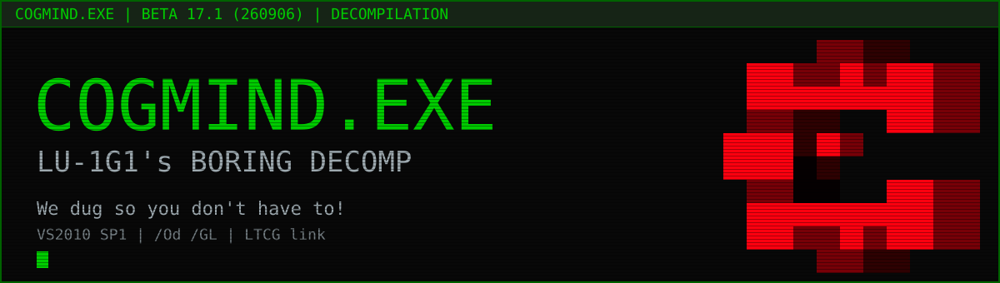

  

# There was a dig

C++ on Visual Studio 2010 SP1 (`/Od /GL`, LTCG link) compiling to byte-identical code for every piece of `COGMIND.exe` (Cogmind Beta 17.1).

## Every function in `src/` is verified against the real game

**The Cogmind game exe is not included** (`resources/*.exe` is git-ignored); [buy the game](https://gridsagegames.com/cogmind/) to get started on the project here and support [Kyzrati on Patreon](https://www.patreon.com/c/Kyzrati/home) to ensure the future of our beloved series.

Fonts: PlasticHeart's [cogfont](https://github.com/plhx/cogfont) (MIT)

Themeing: [Cog-Minder](https://github.com/noemica/cog-minder) (MIT)

Cogmind is the sole property of Grid Sage Games and the authors of this repository are not affiliated with the game or its developer. All trademarks and rights belong to their respective owners. Play nice, don't steal, and have fun while modding your favorite game!
